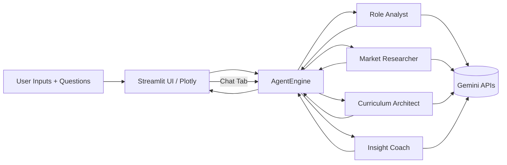
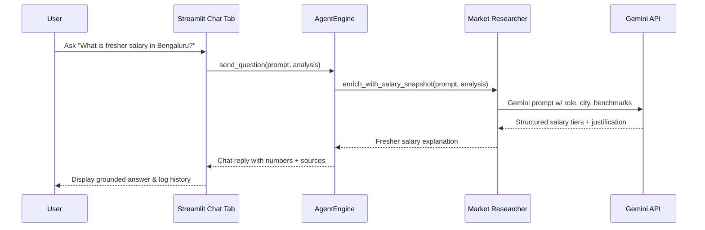
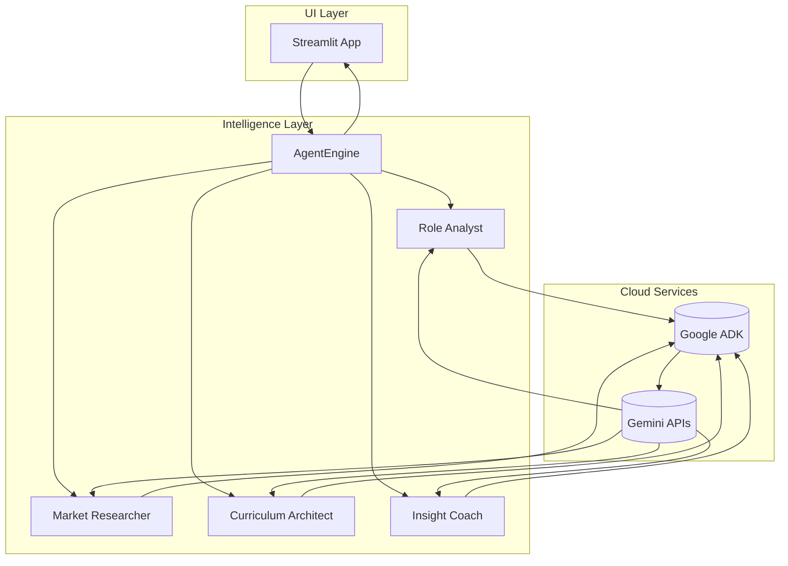

# Career Saathi · Career Guidance Ai Agent ✨

<div align="center">


[](https://streamlit.io/) &nbsp;
[](https://ai.google.dev/gemini-api/docs/agent-dev-kit) &nbsp;
[](https://ai.google.dev/) &nbsp;
[](https://plotly.com/)

</div>

Immersive Streamlit cockpit powered by Google Agent Development Kit (google-adk) agents, Gemini APIs, and Plotly dashboards to ship battle-ready career dossiers for any persona.

## Implementation Highlights

- 🧠 **Google ADK + Gemini**: Every insight is produced by google-adk agents that call Gemini models (1.5 Flash/GPU-friendly variants) for reasoning, narrative generation, and research-backed salary estimates.
- 🤝 **Four-Agent Orchestration**: Role Analyst, Market Researcher, Curriculum Architect, and Insight Coach collaborate through a shared memory buffer so chat replies inherit the full dossier context.
- 🎨 **Glassmorphism UI System**: Streamlit front-end delivers dual-pane forms, animated hero orbits, Plotly salary/radar charts, and a dashboard tab for the embedded Saathi chatbot.
- 💬 **Contextual Chat Surface**: Chat tab consumes the same analysis bundle, enabling users to ask “What’s the fresher salary in Bengaluru?” or “How do I pitch my robotics projects?” with grounded answers.
- 🚀 **Ready for Production**: Strict typing, dataclasses for requests, reusable chart helpers (`visuals.py`), and `requirements.txt` tuned for Streamlit deployment on Streamlit Community Cloud or any container runtime.

## Multi-Agent Intelligence Stack

| Agent                    | Responsibilities                                                                                                 | Gemini Touchpoints                                                    |
| ------------------------ | ---------------------------------------------------------------------------------------------------------------- | --------------------------------------------------------------------- |
| **Role Analyst**         | Crafts 2–3 paragraph role symphony, ten responsibility bullets, and tech stack spotlight mapped to user skills.  | Uses Gemini reasoning prompts to weave persona tone + skill emphasis. |
| **Market Researcher**    | Builds growth line trends, fresher/experienced salary tiers, industry distribution, and market narrative.        | Invokes Gemini for regional salary intelligence and industry deltas.  |
| **Curriculum Architect** | Composes milestone timelines, course playlists, and learning arcs aligned to graduation year + experience level. | Gemini sequences the roadmap and confidence ratings.                  |
| **Insight Coach**        | Outputs culture notes, work-life levers, spotlight stories, and chat-ready spot insights.                        | Gemini storytelling + sentiment ensures vibrant prose.                |

All agents are coordinated by `AgentEngine.run_research`, which:

1. Normalizes the `CareerRequest` dataclass (role, industry, graduation year, location, skill sliders, and stated doubts).
2. Dispatches prompts to each agent via google-adk primitives, optionally enriched with web-search tools.
3. Fuses outputs into a structured dict consumed by the Streamlit tabs and the chat memory store.

## Workflow Diagram 🧭



## Sequence Diagram (Chat Question) 💬



## Tech Stack 🧰

- **Frontend**: Streamlit, Plotly, streamlit-option-menu, streamlit-tags, custom CSS.
- **Intelligence**: google-adk, Gemini APIs (1.5 Flash, Nano fallback), custom agent roles.
- **Visualization**: Plotly line/radar/bar/pie helpers (`visuals.py`).
- **Tooling/Infra**: Python 3.11+, virtualenv (`.venv`), requirements managed via `pip`.

## Setup & Run ▶️

```cmd
cd /d C:\Users\USER\career-saathi
python -m venv .venv
.\.venv\Scripts\activate
pip install -r requirements.txt
.\.venv\Scripts\python.exe -m streamlit run app.py
```

Environment tips:

- Set any GOOGLE_ADK / GEMINI environment variables required by your creds (e.g., `export GOOGLE_API_KEY=...` on PowerShell/cmd via `set`).
- For local experimentation without ADK credentials, `AgentEngine` falls back to deterministic mocked responses so the UI continues to render.

## Block Diagram 🧱



## Repository Layout

- `app.py` – Streamlit UI, Plotly charts, chat tab, form layout, CSS system.
- `agent_engine.py` – CareerRequest dataclass, agent definitions, google-adk orchestration, market/salary logic.
- `visuals.py` – Plotly helper functions (growth line, salary bars, industry pie, radar matrix).
- `requirements.txt` – All Python deps.
- `README.md` – This document.

## Contributing / Extending

1. Create feature branches for new agents or UI sections.
2. Add tests or lint checks (e.g., `pyproject` + `ruff`) before PRs.
3. Document new Gemini prompts in this README to maintain provenance.

## Roadmap

- ✅ Glassmorphism UI + chat tab.
- ✅ Four-agent orchestration feeding dashboards + chat.
- 🔜 Integrate real-time labor stats APIs as additional tools.
- 🔜 Export personalized PDF dossiers per persona and run.

Crafted to inspire career clarity with AI-native storytelling. Enjoy building on it! 🎨🤖
